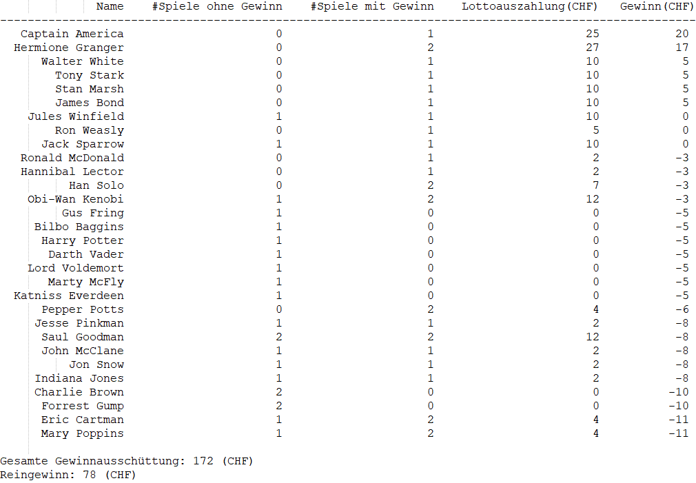

## Anmerkung zum Starten des Projekts
Das Projekt mithilfe von Visual Studio 2022 öffnen.
Terminal öffnen. 
Einen der folgenden Befehle eingeben und Enter betätigen.

Die App kann standardmässig gestertet werden:
- dotnet run --project Lotto Data/Player.json

Oder per zweitem Playerfile:
- dotnet run --project Lotto Data/Player2.json

Bei der Frage nach dem Filepath kann man Data/Lottozahlen.json eingeben. Dies ist der Pfad des schon existierenden Files der von aussen eingegebenen Lottozahlen.
Wenn keine Eingabe per File gewünscht ist, kann einfach Enter gedrückt werden. Das Programm startet nun mit den Standard- Lottozahlen.

Beim Eingabe des Filepath zur Datei wird diese auf die Gültigkeit geprüft. Wenn die Lottozahlen ungültig sind, wird dies geloggt und es wird mit den Standardzahlen fortgefahren.
Das selbe bei den Spielern. Wenn ein Spieler ungültige Lottozahlen hat, wird dies geloggt und es wird für dieses Spiel kein Gewinn berechnet.


# BBZW-Lotto

In diesem Projekt geht es darum, die Gewinne für verschiedene Lottospieler zu berechnen und diese in einer Tabelle darzustellen.

** ABGABE: 7. Dezember 2022 um 23:59 **  


**Diese Aufgabe wird am 7. Dezember abgegeben und bewertet. Diese Bewertung fliesst in
Ihre Modulnote ein. Arbeiten Sie kontinuierlich an der Aufgabe, sodass der
Zwischenstand nach jeder Schulwoche besser ist als die Woche zuvor.**

Das Projekt ist eine Gruppenarbeit (2er-Teams oder 3er-Teams). Teilen sie sich die Arbeiten im Team auf und wenden sie die in diesem Modul gelernten Praktiken an. (TDD, Pair-Programming, etc.)

## Regeln BBZW-Lotto
Beim Lotto wählt man 6 Zahlen zwischen 1 und 22 und eine Glückszahl zwischen 1 und 6.
Nach dem ziehen der Gewinnzahlen wird geschaut, ob und wieviel der gezogenen Zahlen man getroffen hat.   

Dies gibt folgende Gewinne:

| Gewinnrang | #Richtige Zahlen | Richtige Glückszahl | Gewinn  |
|------------|------------------|---------------------|---------|
| 1          | 6                | Ja                  | 5'000'000 |
| 2          | 6                | Nein                | 1'000'000 |
| 3          | 5                | Ja                  | 10'000   |
| 4          | 5                | Nein                | 1'000    |
| 5          | 4                | Ja                  | 150     |
| 6          | 4                | Nein                | 75      |
| 7          | 3                | Ja                  | 25      |
| 8          | 3                | Nein                | 10      |
| 9          | 2                | Ja                  | 5      |
| 10         | 2                | Nein                | 2      |

**Ein Spiel kostet 5.-**


## Daten
Im Verzeichnis `Data/` befinden sich folgende Dateien:

### `Data/player.json`

In dieser Datei befinden sich die Lottospieler. Es ist jeweils der Name des Spielers, seine gewählten Nummern und die Glückszahl. Ein Spieler kann auch mehr als einmal Lotto spielen. D.h. es kann mehrere Einträge mit dem gleichen Spieler geben.

Hier ein Beispiel aus dem Datensatz:
```json
  {
    "Name": "Han Solo",
    "LottoNumbers": ["20","8","14","4","16","15"],
    "LuckyNumber": 3
  },
```

### Data/output.txt

In dieser Datei finden sie das Endresultat über die Lottospieler. Diese Tabelle entspricht dem Output bei den Gewinnzahlen [3, 4, 12, 1, 6, 20] und der Glücksszahl 3.

Die Tabelle sieht folgendermassen aus:



Anmerkungen:
1. `Name`: Name des Lottospielers
2. `#Spiele ohne Gewinn`: Anzahl der Spiele, bei denen kein Gewinn (gemäss Gewinntabelle) erziehlt wurde.
3. `#Spiele mit Gewinn`: Anzahl der Spiele, bei denen irgendein Gewinn (gemäss Gewinntabelle) erziehlt wurde. 
4. `Lottoauszahlung(CHF)`: Aufsummierte ausbezahlte Gewinne, welche für diesen Spieler getätigt wurde. 
4. `Gewinn(CHF)`: Aufsummierter Gewinn, welcher von diesen Spieler erziehlt wurde. 
5. `Gesamte Gewinnausschüttung`: Aufsummierte Gewinnausschüttung, welche über alle Spieler betätigt wurde.
6. `Reingewinn`: Gewinn für die Lottogesellschaft. Dies ist Differenz zwischen den Einnahmen für die Spielkosten und der ausbezahlten Gewinne.

## Projektstruktur

Das C#-Projekt besteht aus zwei Teilen:

1. `Lotto`: hier befindet sich der Produktivcode
2. `Lotto.Tests`: hier befinden sich die Testfälle

### `Lotto/WinCalculator.cs`

Diese Klasse verfügt über eine `Main`-Methode. Diese liest die Spieler mit den getippten Zahlen
aus der JSON-Datei aus und gibt sie auf die Kommandozeile aus. Das Projekt kann
über die Kommandozeile folgendermassen gestartet werden, indem die JSON-Datei
mit den Spielergebnisse als Argument angegeben wird:

    > dotnet run --project Lotto Data/Player.json
    Walter White
    Jesse Pinkman
    Gus Fring
    Saul Goodman

Die Methode `ReadPlayers` liest die Daten aus der JSON-Datei aus und füllt diese in `Player.cs` Objekte ab.

### `Lotto/Player.cs`
Diese Klasse repräsentiert ein Spieler mit seinen Tippzahlen.

### `Lotto.Tests/PlayerTest.cs`
Ein Test für die .ToString() Methode vorhanden. Die Tests können sie über die Kommandozeile folgendermassen ausführen:

    > dotnet test
    Bestanden!   : Fehler:     0, erfolgreich:     1, übersprungen:     0, gesamt:     1, Dauer: < 1 ms - Lotto.Tests.dll (net6.0)
    
## Aufgabe

Adaptieren sie den Code so, dass sie auf der Konsole die Tabelle, welche der Tabelle aus `Data/output.txt` entspricht.
(kleinere Abweichungen wie unterschiedliche Anzahl Leerzeichen sind erlaubt;
inhaltliche Unterschiede sind nicht zulässig).

Sie dürfen den bestehenden Code adaptieren wie sie wollen (Sie dürfen die bestehende Klassen umbenennen, umstrukturieren wie sie wollen).
Am Schluss möchte ich das Programm wie oben beschrieben starten können und die Tabelle enstsprechend angezeigt bekommen.

**Anforderungen (Must)**
- Pro Spieler ist jeweils ein Eintrag zu erstellen.
- Es sollen die Anzahl Versuch mit und ohne Gewinn angezeigt werden.
- Es soll pro Spieler den ausgezahlten Gewinn angezeigt werden.
- Es soll pro Spieler den Gewinn/Verlust angezeigt werden.
- Sortieren sie die Ausgabe nach dem Gewinn. Starten sie mit dem Spieler, welcher am meisten Gewonnen hat. Bei Spieler mit gleichem Gewinn spielt die Sortierung keine Rolle.
- Fassen die die gesamte Gewinnausschüttung über alle Spieler zusammen.
- Fassen sie den Gewinn für die Lottogesellschaft zusammen.
- Sie dürfen die gezogenen Lottozahlen in ihrem Code statisch definieren.
- Sie dürfen davon ausgehen, dass alle gelesenen Zahlen korrekt sind.

**Anforderungen (Bonus für 2er Teams, Must für 3er Teams)**
- Die gezogenen Lottozahlen (inkl. Glückszahl) können vom Benutzer mitgeteilt werden. (Sie dürfen entscheiden ob via File, über die Konsole, etc...) Es ist eine kurze Anweisung zu schreiben, wie die Zahlen mitgegeben werden müssen.
- Überprüfen sie die Gültigkeit der Zahlen der Spieler. (Ausserhalb des gültigen Bereichs, mehrmals die gleiche Nummer im gleichen Spiel gewählt.)

## Definitive Bewertungskriterien

Als Abgabetermin gilt der **7. Dezember (23:59 Uhr).** Das Repository muss mit dem
Tag `v0.1.0` versehen sein! Die Bewertung sollte bis Weihnachten erfolgen.

Die Aufgaben wird nach den folgenden Kriterien bewertet (Punktzahlen in eckigen
Klammern):

- [8] **Kontinuität**: Pro Schulwoche bis zum Abgabetermin gibt es mindestens einen
  substanziellen Commit pro Teilnehmer, der auch gleich gepusht werden muss. Achten sie auf die Commit-Messages.
    - [2] Woche bis 16. November
    - [2] Woche bis 23. November
    - [2] Woche bis 30. November
    - [2] Woche bis 7. Dezember
    - Wer den Tag `v0.1.0` früher setzt, erhält die Punkte für die
      darauffolgenden Wochen ebenfalls. Verpasste Wochen können nicht nachgeholt
      werden.
- [23] **Funktionalität**: Das Programm arbeitet korrekt gemäss den Anforderungen und
  gibt die erwünschte Tabelle aus.
    - [6] Verwendung des Programms:
		- [1] Das Programm kann mit dem Befehl `dotnet run --project Lotto
			  Data/Player.json` gestartet werden und gibt die Tabelle auf die
          Standardausgabe aus.
        - [5] Das Programm kann auch andere JSON-Dateien der gleichen Struktur
          als Kommandozeilenargument entgegennehmen und verarbeiten.
    - [6] Darstellung der Tabelle:
        - [1] Die Tabelle verfügt über eine Titelzeile.
        - [1] Nach der Titelzeile folgt eine Trennzeile.
        - [1] Es folgen genau ein Eintrag pro Spieler.
        - [1] Die Tabelle beinhaltet die folgenden Spalten: `Name`, `# Spiele ohne Gewinn`,
		 `#Spiele mit Gewinn`, `Lottoauszahlung(CHF)`, `Gewinn(CHF)`.
		- [1] Die Tabelle enhält die `Gesamte Gewinnausschüttung` und den `Reingewinn`
        - [1] Die numerischen Angaben sind untereinander rechtsbündig
          angeordnet. (Der Name kann links- oder rechtsbündig angeordnet werden.)
    - [11] Inhalt der Tabelle:
        - [1] Korrekte Sortierung (Absteigend nach Gewinn(CHF)).
        - [1] Korrekte Berechnung von Spielen ohne Gewinn.
        - [1] Korrekte Berechnung von Spielen mit Gewinn.
        - [2] Korrekte Berechnung von Lottoauszahlung an Spieler.
        - [2] Korrekte Berechnung des Gewinns pro Spieler.
        - [2] Korrekte Berechnung der gesamten Gewinnausschüttung.
        - [2] Korrekte Berechnung des Reingewinns für die Lottogesellschaft.
- [6] **Design**: Der Quellcode ist sinnvoll aufgebaut.
    - [4] Der Code ist sinnvoll strukturier. (Aufgaben wurden separiert)
    - [2] Für die Sortierung der Tabelleneinträge verwenden Sie geeignete
      Mechanismen, welche Ihnen vom .NET-Framework zur Verfügung gestellt werden.
- [17] **Unit Tests**: Der Code wird sinnvoll mittels Unit Tests getestet.
    - [1] Pro Klasse im Projekt `Lotto` existiert eine entsprechende
      Testklasse im Projekt `Lotto.Tests`.
    - [1] Pro `public`-Methode im Projekt `Lotto` existiert mindestens
      eine Testmethode im Projekt `Lotto.Tests`.
    - [13] Für die folgenden Aspekte existiert je mindestens ein Testfall:
        - [2] Sortierung der Tabelleneinträge
        - [1] Berechnung der Spiele ohne Gewinn
        - [1] Berechnung der Spiele mit Gewinn
        - [2] Berechnung der Lottoauszahlung an den Spieler
        - [2] Berechnung des Gewinnes pro Spieler
        - [1] Berechnung der gesamten Gewinnausschüttung
        - [1] Berechnung des Reingewinns für die Lottogesellschaft
        - [3] Ausgabe der Tabelle als String
    - [2] Die Unit Tests haben eine gut erkennbare Struktur (Arrange/Act/Assert
      bzw. Given/When/Then, wobei entsprechende Kommentare im Code freiwillig
      sind).
- [15] **Codequalität**: Der Code genügt den behandelten Kriterien zu "Clean Code"
    - [3] Formatierung: Der Code ist durchgehend sinnvoll formatiert.
    - [3] Kommentare: Kommentare werden verwendet, wo sie sinnvoll sind; sie
      sind gut formuliert. Die wichtigsten High-Level APIs werden mithilfe von
      [Documentation
      Comments](https://docs.microsoft.com/en-us/dotnet/csharp/language-reference/language-specification/documentation-comments)
      dokumentiert.
    - [3] Benennung: Die Bezeichner sind sinnvoll gewählt und selbsterklärend.
    - [3] Wiederverwendbarkeit: Code wird nicht dupliziert, sondern ausgelagert.
    - [3] Klarheit: Der Code ist gut verständlich und elegant.
- [8] **Abgabe**: Das Repository befindet sich in einem guten Zustand:
    - [2] Die Tests lassen sich mittels `dotnet test` alle erfolgreich
      ausführen.
    - [2] Es wurden keine unnötigen Dateien (z.B. Binärdaten) hinzugefügt.
    - [2] Die Commit-Messages sind aussagekräftig und durchgehend in der
      gleichen Sprache (Englisch oder Deutsch) gehalten.
    - [2] Die Abgabe ist korrekt getagt (`v0.1.0`).
- [10] **Zusatz 3-er Teams**: Für 3-er Teams werden folgende Punkte ebenfalls bewertet: (für 2-er Teams ist das Bonus)
	- [3] Lottozahlen können von aussen mitgegeben werden
	- [1] Anleitung vorhanden wie Projekt gestartet werden kann (Stichworte reichen -> kann Teil des Repos sein)
	- [2] Zahlen werden auf gültigen Range überprüft
	- [2] Zahlen werden auf mehrmaliges vorkommen überprüft
	- [1] Unit Test für gültigen Range
	- [1] Unit Test für mehrmaliges vorkommen

	

Substanzielle **Plagiate** werden mit null Punkten und mit der Note 1.0
bewertet. Das inkludiert das Kopieren von anderen Repositories.